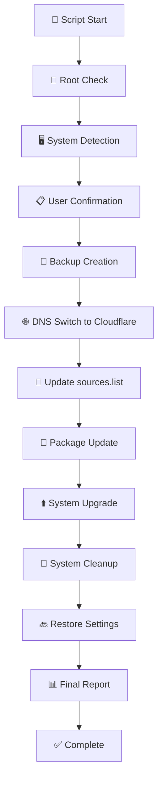

# 🐧 Debian Server Update Script

<div align="center">


**🇹🇷 Professional Debian Server Update Script with Backup & Recovery**  
**🇺🇸 Yedekleme ve Kurtarma ile Profesyonel Debian Sunucu Güncelleme Scripti**

[🚀 Quick Start](#-quick-start) • [📖 Documentation](#-documentation) • [🛠️ Features](#%EF%B8%8F-features) • [📋 Requirements](#-requirements) • [🤝 Contributing](#-contributing)

</div>

---

## 🌟 Overview / Genel Bakış

### 🇺🇸 English
This comprehensive Bash script provides a safe and automated way to update Debian 10, 11, and 12 servers. It includes advanced features like automatic backup, DNS switching, progress tracking, detailed logging, and automatic recovery in case of errors.

### 🇹🇷 Türkçe
Bu kapsamlı Bash scripti, Debian 10, 11 ve 12 sunucularını güvenli ve otomatik bir şekilde güncellemenizi sağlar. Otomatik yedekleme, DNS değiştirme, ilerleme takibi, detaylı loglama ve hata durumunda otomatik kurtarma gibi gelişmiş özellikler içerir.

---

## 🚀 Quick Start

### 📥 Installation Methods

#### Method 1: Using curl
```bash
# Download and run directly
curl -fsSL https://raw.githubusercontent.com/MRsuffixx/debian-package-updater/main/debian_update.sh | sudo bash

# Or download first, then run
curl -O https://raw.githubusercontent.com/MRsuffixx/debian-package-updater/main/debian_update.sh
chmod +x debian_update.sh
sudo ./debian_update.sh
```

#### Method 2: Using wget
```bash
# Download and run directly
wget -qO- https://raw.githubusercontent.com/MRsuffixx/debian-package-updater/main/debian_update.sh | sudo bash

# Or download first, then run
wget https://raw.githubusercontent.com/MRsuffixx/debian-package-updater/main/debian_update.sh
chmod +x debian_update.sh
sudo ./debian_update.sh
```

#### Method 3: Git clone
```bash
git clone https://github.com/MRsuffixx/debian-package-updater.git
cd REPOSITORY
chmod +x debian_update.sh
sudo ./debian_update.sh
```

---

## 🛠️ Features

<table>
<tr>
<td width="50%">

### 🇺🇸 English Features

✅ **Smart System Detection**
- Automatically detects Debian 10/11/12
- System compatibility checks
- Hardware resource monitoring

🔒 **Security & Backup**
- Automatic backup of critical files
- DNS configuration backup
- Safe rollback on errors
- Root privilege verification

🌐 **Network Optimization**
- Temporary Cloudflare DNS (1.1.1.1)
- Optimized repository sources
- Connection stability checks

📊 **Advanced Monitoring**
- Real-time progress bars
- Colored output for easy reading
- Comprehensive logging system
- Performance metrics

🧹 **System Maintenance**
- Automatic package cleanup
- Old kernel removal
- Cache optimization
- Dependency resolution

</td>
<td width="50%">

### 🇹🇷 Türkçe Özellikler

✅ **Akıllı Sistem Tespiti**
- Debian 10/11/12 otomatik tespiti
- Sistem uyumluluk kontrolleri
- Donanım kaynak izleme

🔒 **Güvenlik ve Yedekleme**
- Kritik dosyaların otomatik yedeği
- DNS yapılandırma yedeği
- Hata durumunda güvenli geri alma
- Root yetki doğrulaması

🌐 **Ağ Optimizasyonu**
- Geçici Cloudflare DNS (1.1.1.1)
- Optimize edilmiş depo kaynakları
- Bağlantı kararlılık kontrolleri

📊 **Gelişmiş İzleme**
- Gerçek zamanlı ilerleme çubukları
- Kolay okuma için renkli çıktı
- Kapsamlı loglama sistemi
- Performans metrikleri

🧹 **Sistem Bakımı**
- Otomatik paket temizligi
- Eski kernel temizleme
- Cache optimizasyonu
- Bağımlılık çözümlemesi

</td>
</tr>
</table>

---

## 📋 Requirements

<div align="center">

| Requirement | Minimum | Recommended |
|-------------|---------|-------------|
| **OS** | Debian 10+ | Debian 11/12 |
| **RAM** | 512 MB | 1 GB+ |
| **Storage** | 2 GB free | 5 GB+ free |
| **Network** | Internet | Stable connection |
| **Privileges** | Root/sudo | Root access |

</div>

### 🔧 System Dependencies
```bash
# These packages are usually pre-installed
apt-get update
apt-get install -y curl wget bash coreutils
```

---

## 📖 Documentation

### 🎯 Script Workflow



### 📁 Directory Structure

```
/var/log/debian-update/          # Log files
├── update-YYYYMMDD-HHMMSS.log   # Main log file
├── sources.list.backup          # Backup files
└── resolv.conf.backup           # DNS backup

/tmp/debian-update-backup/       # Temporary backups
├── sources.list.backup          # Original sources.list
└── resolv.conf.backup          # Original DNS config
```

### 🎨 Output Examples

#### Successful Update
```bash
############################################################################
#                        GÜNCELLEME RAPORU                                #
############################################################################

Sistem Bilgileri:
  • Debian Sürümü: 12
  • Güncelleme Tarihi: 2024-01-15 14:30:25
  • İşlem Süresi: 0s 15d 42s

İşlem Detayları:
  • sources.list güncellendi ve geri yüklendi
  • DNS geçici olarak Cloudflare kullanıldı
  • Tüm güncellemeler uygulandı
  • Sistem temizliği yapıldı

Log Dosyası: /var/log/debian-update/update-20240115-143025.log

✅ Güncelleme işlemi başarıyla tamamlandı!
```

---

## ⚙️ Configuration

### 🎛️ Customizable Variables

You can modify these variables at the top of the script:

```bash
# Logging configuration
LOG_DIR="/var/log/debian-update"           # Log directory
BACKUP_DIR="/tmp/debian-update-backup"     # Backup directory

# DNS configuration
DNS_PRIMARY="1.1.1.1"    # Cloudflare primary DNS
DNS_SECONDARY="1.0.0.1"  # Cloudflare secondary DNS

# Cleanup settings
KEEP_KERNELS=2           # Number of kernels to keep
LOG_RETENTION_DAYS=30    # Days to keep old logs
```

### 🔧 Advanced Usage

#### Silent Mode (Non-interactive)
```bash
# Skip confirmation prompt
echo "e" | sudo ./debian_update.sh

# Or modify the script to set AUTO_CONFIRM=true
```

#### Custom Sources List
```bash
# You can provide your own sources.list template
# Edit the create_sources_list() function in the script
```

---

## 🐛 Troubleshooting

<details>
<summary>🔍 Common Issues</summary>

### Issue: Permission Denied
```bash
# Solution: Run with sudo
sudo ./debian_update.sh
```

### Issue: Network Connection Failed
```bash
# Check internet connectivity
ping -c 4 8.8.8.8

# Check DNS resolution
nslookup google.com
```

### Issue: Insufficient Disk Space
```bash
# Check available space
df -h

# Clean up before running
sudo apt-get clean
sudo apt-get autoremove
```

</details>

<details>
<summary>📋 Log Analysis</summary>

### View Current Log
```bash
tail -f /var/log/debian-update/update-*.log
```

### Search for Errors
```bash
grep -i "error\|failed" /var/log/debian-update/update-*.log
```

### Check System Status
```bash
systemctl status
free -h
df -h
```

</details>

---

## 🔐 Security Considerations

### 🛡️ Security Features

- **✅ Automatic Backup**: All critical files are backed up before modification
- **✅ Rollback Capability**: Automatic restoration on failure
- **✅ DNS Safety**: Temporary DNS changes with automatic restoration
- **✅ Permission Checks**: Validates root privileges before execution
- **✅ Signal Handling**: Graceful cleanup on interruption

### 🚨 Security Best Practices

1. **Review the script** before running on production systems
2. **Test on a staging environment** first
3. **Ensure backups** of critical data exist
4. **Monitor the process** during execution
5. **Verify system stability** after completion

---

## 🤝 Contributing

### 🌟 How to Contribute

1. **Fork** the repository
2. **Create** a feature branch (`git checkout -b feature/amazing-feature`)
3. **Commit** your changes (`git commit -m 'Add amazing feature'`)
4. **Push** to the branch (`git push origin feature/amazing-feature`)
5. **Open** a Pull Request

### 🐛 Bug Reports

Please use the [GitHub Issues](https://github.com/MRsuffixx/debian-package-updater/issues) page to report bugs. Include:

- Operating system version
- Script output/error messages
- Steps to reproduce
- Expected vs actual behavior

### 💡 Feature Requests

We welcome feature requests! Please provide:

- Clear description of the feature
- Use case examples
- Implementation suggestions (if any)

---

## 📊 Compatibility Matrix

| Debian Version | Status | Notes |
|----------------|--------|-------|
| **Debian 10 (Buster)** | ✅ Fully Supported | LTS until 2024 |
| **Debian 11 (Bullseye)** | ✅ Fully Supported | Current stable |
| **Debian 12 (Bookworm)** | ✅ Fully Supported | Latest stable |
| **Debian 13 (Trixie)** | ⚠️ Testing | Future support planned |

---

## 📄 License

This project is licensed under the MIT License - see the [LICENSE](LICENSE) file for details.

```
MIT License

Copyright (c) 2024 Debian Update Script

Permission is hereby granted, free of charge, to any person obtaining a copy
of this software and associated documentation files (the "Software"), to deal
in the Software without restriction, including without limitation the rights
to use, copy, modify, merge, publish, distribute, sublicense, and/or sell
copies of the Software, and to permit persons to whom the Software is
furnished to do so, subject to the following conditions:

The above copyright notice and this permission notice shall be included in all
copies or substantial portions of the Software.
```

---

## 🙏 Acknowledgments

### 🌟 Special Thanks

- **Debian Project** - For the amazing operating system
- **Cloudflare** - For providing reliable DNS services
- **Community Contributors** - For testing and feedback
- **Open Source Community** - For inspiration and support

### 🔗 Useful Links

- [Debian Official Documentation](https://www.debian.org/doc/)
- [Debian Package Management](https://www.debian.org/doc/manuals/debian-reference/ch02.en.html)
- [Bash Scripting Guide](https://www.gnu.org/software/bash/manual/)
- [Cloudflare DNS](https://developers.cloudflare.com/1.1.1.1/)

---

## 📞 Support

<div align="center">

### 🆘 Need Help?

[](https://github.com/MRsuffixx/debian-package-updater/issues)
[](https://github.com/MRsuffixx/debian-package-updater/wiki)
[](https://github.com/MRsuffixx/debian-package-updater/discussions)

</div>

### 📧 Contact Information

- **🇺🇸 English Support**: Create an issue in English
- **🇹🇷 Türkçe Destek**: Türkçe issue oluşturabilirsiniz
- **📱 Community**: Join our discussions for community support

---

<div align="center">

### ⭐ Star History

[](https://star-history.com/#MRsuffixx/debian-package-updater&Date)

**If this script helped you, please consider giving it a ⭐️!**  
**Bu script size yardımcı olduysa, lütfen ⭐️ vermeyi düşünün!**

---

Made with ❤️ by the Open Source Community | Açık Kaynak Topluluğu tarafından ❤️ ile yapılmıştır

</div>
